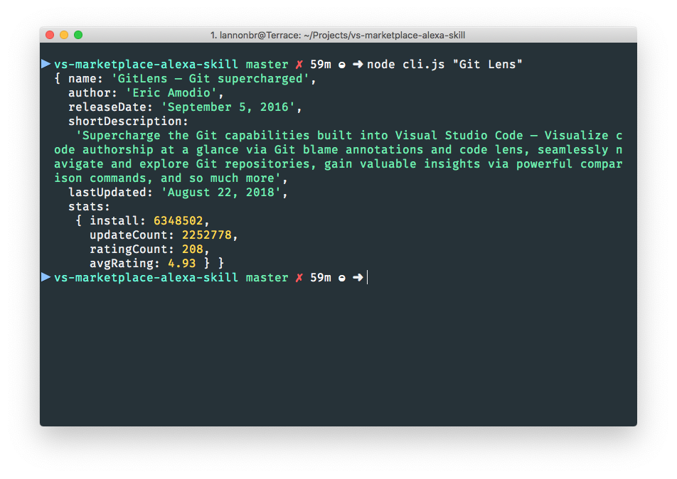

# VS Marketplace Alexa Skill

An Alexa skill to listen to information about VS Code extensions.

The skill is currently in development, but as well, there is a CLI interface. The CLI takes a string as an argument and will return a set of data about an extension using the VS Marketplace API.

